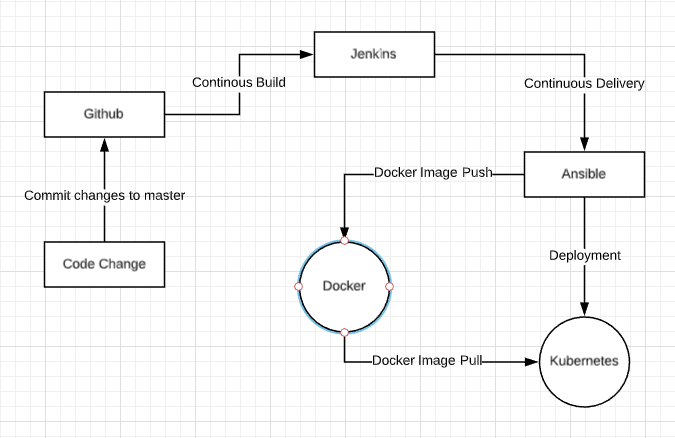

# DevOps-101-Pipeline-Build-01

### Creating a Development pipeline in Devops

In this project, I will be using various Devops tools to build this development stage CI/CD pipeline for a simple [Coronavirus Cases Visulaizer Application](https://github.com/priyansh19/Corona-Virus-Tracker)

Tools Used:

- Git
- Github
- Maven
- Jenkins
- Ansible
- Docker
- Kubernetes

### Flow of the pipeline will be:

 

